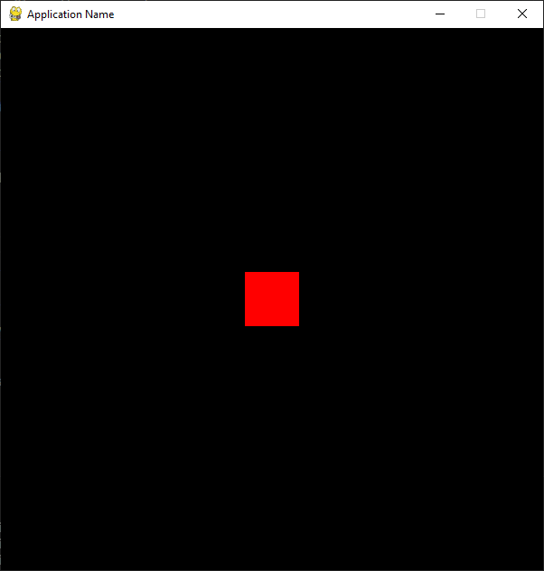

# Pygame Boilerplate (OOP)

This is a basic boilerplate for a Pygame application. It provides a simple framework to help you get started with Pygame, including basic event handling, a game loop, and rendering.

## Features

- Initialization of Pygame and its mixer.
- A simple event handling system to manage quitting the application.
- A main game loop that updates and renders the application at a specified frame rate.
- Customizable colors through a `Colors` class.

## Requirements

- Python 3.x
- pygame

## Installation

1. Clone this repository:
```bash
git clone https://github.com/kstzl/pygame-boilerplate
cd pygame-boilerplate
pip install pygame
```
## Usage 
1. Edit the `pygame_boilerplate.py` file.
2. Modify the window width, height, title, and FPS as needed:
```python
app = PygameApplication(
    window_width=600,
    window_height=600,
    window_title="Application Name",
    fps=60
)
```
3. Run the application
```bash
python pygame_boilerplate.py
```

Have fun ! :) 
